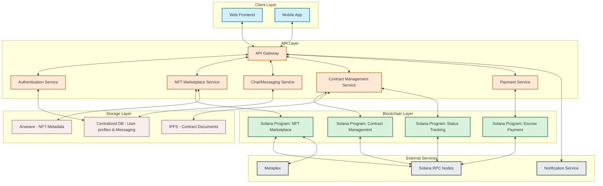

# Real World Asset (Clothing) on Solana - Backend Architecture

## Component Descriptions:

### Client Layer
- **Web Frontend**: Browser-based application for clients and tailors
- **Mobile App**: Native mobile application with same functionality

### API Layer
- **API Gateway**: Central entry point for all client requests
- **Authentication Service**: Handles user login, wallet connection, and authorization
- **NFT Marketplace Service**: Manages NFT listing, browsing, and details
- **Chat/Messaging Service**: Handles client-tailor discussions and negotiations
- **Contract Management Service**: Creates and tracks hashed contracts
- **Payment Service**: Manages escrow payment flow

### Blockchain Layer
- **NFT Marketplace Program**: Solana program for tokenizing and trading clothing designs
- **Contract Management Program**: Stores and manages contract agreements
- **Escrow Payment Program**: Holds client payments until delivery
- **Status Tracking Program**: Updates and stores the status of contracts (Started, Fabric Purchased, etc.)

### Storage Layer
- **Arweave**: Permanent storage for NFT metadata and images
- **IPFS**: Decentralized storage for contract documents
- **Centralized DB**: Stores user profiles, messages, and non-blockchain data

### External Services
- **Solana RPC Nodes**: Connection to Solana blockchain
- **Metaplex**: NFT standard for Solana
- **Notification Service**: Sends updates to users about contract status changes

## Data Flow
1. Users interact with Web/Mobile interfaces
2. Requests go through API Gateway for processing
3. Services interact with Solana Programs through RPC Nodes
4. Contract statuses and NFT data are stored on-chain
5. Metadata and documents are stored in decentralized storage
6. User data and messages are stored in centralized database
7. Status updates trigger notifications to relevant parties 