# Real World Asset (Clothing) on Solana - Technical Backend Architecture

```mermaid
flowchart TB
    subgraph Client Layer
        A[React.js/Next.js Web App]
        B[React Native Mobile App]
        A1[Wallet Adapter: Phantom/Solflare]
        B1[WalletConnect Protocol]
    end

    subgraph API Layer
        C[GraphQL API Gateway + REST Fallback]
        D[OAuth2/JWT Auth + Wallet Auth Service]
        E[NFT Marketplace Microservice]
        F[WebSocket-based Messaging Service]
        G[Smart Contract Interaction Service]
        H[Escrow Payment Orchestration Service]
        X[Redis Cache]
    end

    subgraph Blockchain Layer
        I[Metaplex NFT Protocol on Solana]
        J[Custom Anchor Program: Contract Management]
        K[Custom SPL Token-based Escrow Program]
        L[Contract State PDA Management Program]
        Z[Cross-Program Invocation Handler]
    end

    subgraph Storage Layer
        M[Arweave bundlr: NFT Metadata + URI]
        N[IPFS/Filecoin via NFT.Storage: Contract Documents]
        O[PostgreSQL: User Profiles + Messaging]
        O1[MongoDB: Analytics/Event Logs]
        O2[ElasticSearch: Search Indexing]
    end

    subgraph Infrastructure
        P[Solana mainnet-beta RPC endpoints]
        P1[Solana Program Deploy Framework]
        P2[Helius/GenesysGo Node Services]
        Q[Metaplex Token Metadata Contract]
        R[Firebase Cloud Messaging]
        S[Infrastructure: Docker + Kubernetes]
        T[CI/CD: GitHub Actions]
        U[Monitoring: Prometheus + Grafana]
        V[BFT Consensus Module]
    end

    %% Connections with protocols
    A <--> |HTTPS/WSS| C
    B <--> |REST/GraphQL| C
    A --- A1
    B --- B1
    A1 <--> |Web3 Auth| D
    B1 <--> |Web3 Auth| D
    
    C <--> |JWT Auth| D
    C <--> |GraphQL Resolvers| E
    C <--> |WebSockets| F
    C <--> |JSON-RPC| G
    C <--> |Event-Driven| H
    C --- |LRU Caching| X
    
    D <--> |CRUD Ops| O
    E <--> |CPI Calls| I
    E <--> |Content Addressing| M
    F <--> |ACID Transactions| O
    G <--> |Transaction Signing| J
    G <--> |IPFS Protocol| N
    H <--> |Atomic Commits| K
    G <--> |PDA Derivation| L
    
    I <--> |borsh Serialization| P
    J <--> |Anchor Framework| P
    K <--> |SPL Token Standard| P
    L <--> |Account Model| P
    I --- Z
    J --- Z
    K --- Z
    L --- Z
    
    I <--> |Token Metadata Standard| Q
    G <--> |State Updates| L
    
    C <--> |Push Protocol| R
    E --- |Replica Sets| O2
    G --- |Sharded Storage| O1
    
    P --- P1
    P --- P2
    P1 --- T
    S --- T
    S --- U
    K --- V
    
    %% Styling
    classDef clientLayer fill:#d1f0ff,stroke:#0077b6,stroke-width:2px,color:black
    classDef apiLayer fill:#ffe8d6,stroke:#bc6c25,stroke-width:2px,color:black
    classDef blockchainLayer fill:#d8f3dc,stroke:#2d6a4f,stroke-width:2px,color:black
    classDef storageLayer fill:#f8edeb,stroke:#9d8189,stroke-width:2px,color:black
    classDef infraLayer fill:#e9ecef,stroke:#343a40,stroke-width:2px,color:black
    
    class A,B,A1,B1 clientLayer
    class C,D,E,F,G,H,X apiLayer
    class I,J,K,L,Z blockchainLayer
    class M,N,O,O1,O2 storageLayer
    class P,P1,P2,Q,R,S,T,U,V infraLayer
```

## Technical Component Details

### Client Layer
- **React.js/Next.js Web App**: SSR-optimized SPA with TypeScript, Redux state management, and TailwindCSS
- **React Native Mobile App**: Cross-platform mobile implementation with native modules for wallet integrations
- **Wallet Adapter**: Integration with multiple Solana wallets via `@solana/wallet-adapter-react` library
- **WalletConnect Protocol**: QR-based deep linking for mobile wallet authorization flow

### API Layer
- **GraphQL API Gateway**: Apollo Server implementation with schema stitching and REST fallback routes
- **Authentication Service**: Multi-factor wallet-based authentication with JWT token issuance and session management
- **NFT Marketplace Service**: Rust-based microservice for handling NFT operations with database projection
- **WebSocket Messaging**: Real-time messaging infrastructure with presence detection and message persistence
- **Smart Contract Service**: Transaction construction, signing, and simulation service with retry mechanisms
- **Escrow Orchestration**: State machine-based orchestration of multi-party escrow flows with recovery patterns
- **Redis Cache**: In-memory caching layer for high-frequency queries with TTL expiration policies

### Blockchain Layer
- **Metaplex NFT Protocol**: Implements the Metaplex NFT standard for cloth tokenization with custom attributes
- **Contract Management Program**: Anchor-based Solana program with 1024-byte contract hash storage and verification
- **Escrow Payment Program**: SPL token-based two-phase commit escrow system with time-locked release mechanism
- **Status Tracking Program**: Program Derived Address (PDA) management for contract status on-chain with event emission
- **CPI Handler**: Cross-Program Invocation facilitation module for atomic multi-program interactions

### Storage Layer
- **Arweave/Bundlr**: Permanent storage for NFT metadata with content addressing and proof-of-access
- **IPFS/Filecoin**: Decentralized document storage with content-addressable hashing for immutable contract records
- **PostgreSQL**: Relational database with foreign key constraints for user profiles and normalized data models
- **MongoDB**: Document store for event logs and analytics with time-series optimization
- **ElasticSearch**: Inverted index for fast full-text search across NFT metadata and contract terms

### Infrastructure
- **Solana RPC**: JSON-RPC endpoints for mainnet-beta with load balancing and redundancy
- **Program Deploy Framework**: Deployment pipeline for Solana program binaries with versioning and migration scripts
- **Node Services**: Specialized RPC providers with archive data and websocket subscription support
- **Metaplex Contracts**: Integration with Token Metadata standard contracts for NFT standards compliance
- **Push Notifications**: Firebase Cloud Messaging for mobile alerts with topic-based subscription model
- **Containerization**: Docker containers orchestrated by Kubernetes with auto-scaling policies
- **CI/CD Pipeline**: GitHub Actions for automated testing, building, and deployment workflows
- **Monitoring Stack**: Prometheus metrics collection with Grafana dashboards and alerting rules
- **Consensus Module**: Byzantine Fault Tolerance implementation for dispute resolution mechanisms

## Technical Data Flow

1. **Authentication Flow**:
   - Client connects wallet via `@solana/wallet-adapter-react` or WalletConnect
   - Wallet signs challenge message using ed25519 cryptography
   - Server verifies signature against public key and issues JWT with scoped permissions
   - Redis caches session token with sliding expiration

2. **NFT Creation Flow**:
   - Tailor uploads design assets (compressed with WebP format)
   - Assets bundled and uploaded to Arweave via Bundlr with SOL payment
   - Metadata JSON constructed according to Metaplex standard with custom attributes
   - NFT minted through Metaplex CandyMachine or direct mint instruction
   - Indexer captures on-chain event and updates ElasticSearch

3. **Contract Creation Flow**:
   - Contract terms serialized to JSON document
   - Document hashed using SHA-256 algorithm
   - Hash stored on-chain through Contract Management Program
   - Full document stored on IPFS with CID reference on-chain
   - Status PDA initialized with "Contract Started" state

4. **Escrow Payment Flow**:
   - Client deposits USDC (SPL token) into escrow program PDA
   - Escrow account locked with multi-signature release condition
   - Status tracking program updated via CPI call
   - WebHook triggers notification through Firebase

5. **Status Update Flow**:
   - Status update transaction signed by tailor
   - Transaction validated against contract PDA authority
   - State transition rules enforced on-chain
   - Event emitted and captured by off-chain indexer
   - GraphQL subscriptions notify all relevant parties

6. **Payment Release Flow**:
   - Client confirms delivery through multi-signature transaction
   - Time-lock validation performed on-chain
   - Atomic transfer execution with SPL token program
   - Receipt NFT minted as proof of completed transaction

## Technical Considerations

- **Scalability**: Horizontal scaling through stateless microservices and database sharding
- **Security**: On-chain verification of all critical operations with off-chain convenience layer
- **Privacy**: Zero-knowledge proofs for selective disclosure of contract terms
- **Performance**: Read replicas and caching strategies to minimize RPC load
- **Compliance**: Digital signature compliance with eIDAS regulation for contract validity
- **Fault Tolerance**: Circuit breaker patterns for RPC node failover and transaction retry with idempotency keys 