# Fabric Radar: Architecture Diagram

## Overview
Fabric Radar is a platform connecting tailors with potential clients, using the Stellar blockchain to create secure contracts and tokenized fabric representations as NFTs.

```mermaid
graph TD
    subgraph "Frontend"
        A[Web Application] --> B[Mobile Application]
        A --> C[Administrator Dashboard]
    end

    subgraph "Backend Services"
        D[User Authentication Service]
        E[Tailor Management Service]
        F[Client Management Service]
        G[Contract Management Service]
        H[Payment Processing Service]
        I[Shipment Tracking Service]
        J[KYC Verification Service]
        K[Notification Service]
    end

    subgraph "Blockchain Layer"
        L[Stellar Blockchain]
        M[NFT Contract Generator]
        N[Asset Tokenization Engine]
        O[Smart Contract Validator]
    end

    subgraph "Data Storage"
        P[User Database]
        Q[Fabric Catalog]
        R[Contract Records]
        S[Transaction History]
    end

    subgraph "External Integrations"
        T[Payment Gateways]
        U[Google Maps API]
        V[KYC Providers]
        W[Stable Coin Bridge]
    end

    %% Frontend to Backend Connections
    A --> D
    A --> E
    A --> F
    A --> G
    A --> H
    A --> I
    A --> K
    B --> D
    B --> E
    B --> F
    B --> G
    B --> H
    B --> I
    B --> K
    C --> D
    C --> E
    C --> F
    C --> G
    C --> H
    C --> I
    C --> J
    C --> K

    %% Backend to Blockchain Connections
    E --> N
    F --> M
    G --> M
    G --> O
    H --> L
    H --> W

    %% Backend to Data Storage
    D --> P
    E --> Q
    F --> P
    G --> R
    H --> S
    J --> P

    %% Backend to External Integration
    H --> T
    I --> U
    J --> V
    H --> W
```

## Component Description

### Frontend
- **Web Application**: Primary interface for users (tailors and clients)
- **Mobile Application**: Mobile version with all key functionalities
- **Administrator Dashboard**: Platform management, verification, and oversight

### Backend Services
- **User Authentication Service**: Handles login, registration, and session management
- **Tailor Management Service**: Profile management for tailors, portfolio uploads
- **Client Management Service**: Client profile and preference management
- **Contract Management Service**: Handles contract creation, updates, and fulfillment
- **Payment Processing Service**: Processes client payments and tailor withdrawals
- **Shipment Tracking Service**: Tracks delivery of completed garments
- **KYC Verification Service**: Verifies identity of users
- **Notification Service**: Sends updates to all parties

### Blockchain Layer
- **Stellar Blockchain**: Core blockchain infrastructure
- **NFT Contract Generator**: Creates blockchain-based contracts between parties
- **Asset Tokenization Engine**: Tokenizes fabric designs as NFTs
- **Smart Contract Validator**: Validates contract conditions and triggers payments

### Data Storage
- **User Database**: Stores user profiles, authentication data
- **Fabric Catalog**: Repository of fabric designs and tailor portfolios
- **Contract Records**: Records of all agreements between parties
- **Transaction History**: History of all financial transactions

### External Integrations
- **Payment Gateways**: Integration with local payment systems
- **Google Maps API**: For shipment tracking
- **KYC Providers**: Third-party KYC verification services
- **Stable Coin Bridge**: Converts local currency to stable coins (USDC/USDT)

## User Flow

1. **Registration & KYC**
   - Users register and complete KYC verification
   - Tailors upload their portfolio and fabric designs

2. **Browsing & Selection**
   - Clients browse available tailors and designs
   - Each design is tokenized as an NFT on Stellar

3. **Negotiation & Agreement**
   - Client and tailor discuss requirements and pricing
   - Once agreed, a digital contract is created

4. **Contract Creation**
   - Smart contract is generated with agreed terms
   - Contract is hashed and stored on Stellar blockchain

5. **Multi-party Validation**
   - Client validates the contract
   - Tailor validates the contract
   - Platform admin validates the contract

6. **Payment Processing**
   - Client pays in local currency
   - Payment is converted to stablecoin
   - Held in escrow until contract completion

7. **Fulfillment & Delivery**
   - Tailor creates the garment
   - Shipment is tracked via Google Maps integration
   - Client confirms receipt and satisfaction

8. **Payment Release**
   - Funds are released to tailor
   - Tailor can withdraw via local payment channels
   - Transaction record is updated on blockchain

9. **NFT Ownership**
   - Completed garment design NFT is available to both parties
   - Serves as proof of transaction and design ownership 