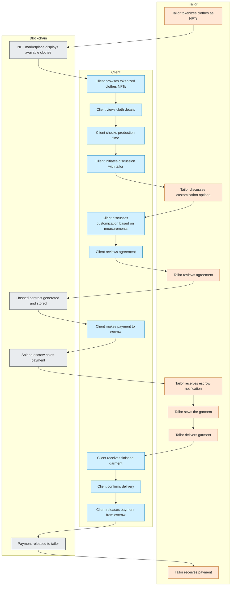

# Real World Asset (Clothing) on Solana - User Flow Diagram

## Detailed Process:

1. **NFT Creation & Marketplace:**
   - Tailor tokenizes available clothing designs as NFTs on Solana
   - NFTs contain details about the garment and production time

2. **Client Selection & Discussion:**
   - Client browses available clothing NFTs
   - Client views details and production time
   - Client initiates discussion with tailor
   - Both parties discuss customizations based on measurements

3. **Agreement & Payment:**
   - Once both parties agree on terms
   - Hashed contract agreement is generated and stored on-chain
   - Client makes payment to Solana escrow program

4. **Production & Delivery:**
   - Tailor sews the garment according to agreement
   - Tailor delivers finished product to client (in-person or via dispatch)

5. **Completion:**
   - Client confirms satisfactory delivery
   - Payment is released from escrow to tailor
   - Contract remains permanently accessible on blockchain 